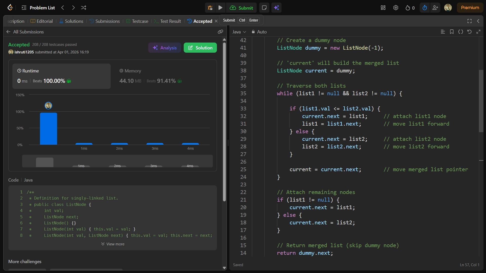

## Date: 01 April 2026 (Day 11)  
**Name:** Shruti  
**Programming Language:** Java 

## Problem Statement
[Easy] Merge Two Sorted Lists

## Approach
I used an iterative approach with a dummy node to compare nodes from both sorted lists and attach the smaller one to the merged list, continuing until one list ends and then appending the remaining nodes in O(n + m) time.

## Code

```java
/**
 * Definition for singly-linked list.
 * public class ListNode {
 *     int val;
 *     ListNode next;
 *     ListNode() {}
 *     ListNode(int val) { this.val = val; }
 *     ListNode(int val, ListNode next) { this.val = val; this.next = next; }
 * }
 */

class Solution {
    public ListNode mergeTwoLists(ListNode list1, ListNode list2) {
        
        // Create a dummy node
        ListNode dummy = new ListNode(-1);

        // 'current' will build the merged list
        ListNode current = dummy;

        // Traverse both lists
        while (list1 != null && list2 != null) {

            if (list1.val <= list2.val) {
                current.next = list1;     // attach list1 node
                list1 = list1.next;       // move list1 forward
            } else {
                current.next = list2;     // attach list2 node
                list2 = list2.next;       // move list2 forward
            }

            current = current.next;       // move merged list pointer
        }

        // Attach remaining nodes
        if (list1 != null) {
            current.next = list1;
        } else {
            current.next = list2;
        }

        // Return merged list (skip dummy node)
        return dummy.next;

    }
}

/*
Merge step of Merge Sort applied to linked lists:

class Solution {
    public ListNode mergeTwoLists(ListNode list1, ListNode list2) {
        
        // If any list is empty, return the other
        if (list1 == null) return list2;
        if (list2 == null) return list1;

        // Pick starting node
        ListNode start;

        if (list1.val < list2.val) {
            start = list1;
            list1 = list1.next;
        } else {
            start = list2;
            list2 = list2.next;
        }

        // Pointer used to attach nodes
        ListNode current = start;

        // Merge
        while (list1 != null && list2 != null) {

            if (list1.val < list2.val) {
                current.next = list1;
                list1 = list1.next;
            } else {
                current.next = list2;
                list2 = list2.next;
            }

            current = current.next;
        }

        // Attach remaining list
        if (list1 != null) {
            current.next = list1;
        } else {
            current.next = list2;
        }

        return start;

    }
}
*/
```

## Accepted Solution Screenshot

