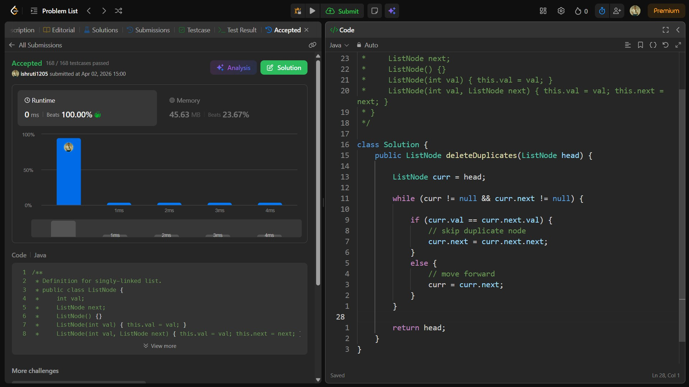

## Date: 02 April 2026 (Day 12)  
**Name:** Shruti  
**Programming Language:** Java 

## Problem Statement
[Easy] Remove Duplicates from Sorted Lists

## Approach
I traversed the sorted linked list and compared each node with its next node; if duplicate values were found, I skipped the duplicate by updating the next pointer, ensuring all elements remain unique in O(n) time.

## Code

```java
/**
 * Definition for singly-linked list.
 * public class ListNode {
 *     int val;
 *     ListNode next;
 *     ListNode() {}
 *     ListNode(int val) { this.val = val; }
 *     ListNode(int val, ListNode next) { this.val = val; this.next = next; }
 * }
 */

class Solution {
    public ListNode deleteDuplicates(ListNode head) {

        ListNode curr = head;

        while (curr != null && curr.next != null) {

            if (curr.val == curr.next.val) {
                // skip duplicate node
                curr.next = curr.next.next;
            } 
            else {
                // move forward
                curr = curr.next;
            }
        }

        return head;
    }
}
```

## Accepted Solution Screenshot

