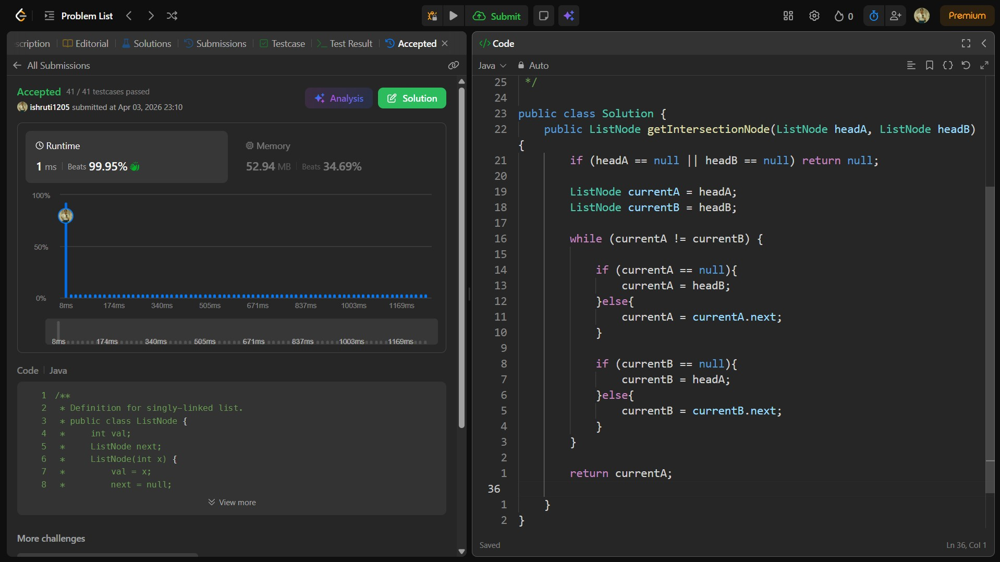

## Date: 03 April 2026 (Day 13)  
**Name:** Shruti  
**Programming Language:** Java 

## Problem Statement
[Easy] Intersection of Two Linked Lists

## Approach
I used a two-pointer technique where each pointer traverses both linked lists sequentially; by switching to the other list after reaching the end, both pointers align and meet at the intersection node in O(n + m) time.

## Code

```java
/**
 * Definition for singly-linked list.
 * public class ListNode {
 *     int val;
 *     ListNode next;
 *     ListNode(int x) {
 *         val = x;
 *         next = null;
 *     }
 * }
 */

public class Solution {
    public ListNode getIntersectionNode(ListNode headA, ListNode headB) {
        if (headA == null || headB == null) return null;

        ListNode currentA = headA;
        ListNode currentB = headB;

        while (currentA != currentB) {

            if (currentA == null){
                currentA = headB;
            }else{
                currentA = currentA.next;
            }

            if (currentB == null){
                currentB = headA;
            }else{
                currentB = currentB.next;
            }
        }

        return currentA;

    }
}
```

## Accepted Solution Screenshot

