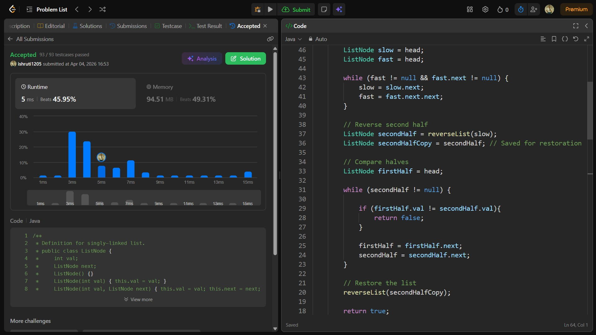

## Date: 04 April 2026 (Day 14)  
**Name:** Shruti  
**Programming Language:** Java 

## Problem Statement
[Easy] Palindrome Linked Lists

## Approach
I used the slow and fast pointer technique to find the middle of the linked list, reversed the second half, and then compared both halves node by node to check if the list forms a palindrome in O(n) time and O(1) space.

## Code

```java
/**
 * Definition for singly-linked list.
 * public class ListNode {
 *     int val;
 *     ListNode next;
 *     ListNode() {}
 *     ListNode(int val) { this.val = val; }
 *     ListNode(int val, ListNode next) { this.val = val; this.next = next; }
 * }
 */

class Solution {
    public boolean isPalindrome(ListNode head) {

        if (head == null || head.next == null) return true;

        // Find middle
        ListNode slow = head;
        ListNode fast = head;

        while (fast != null && fast.next != null) {
            slow = slow.next;
            fast = fast.next.next;
        }

        // Reverse second half
        ListNode secondHalf = reverseList(slow);
        ListNode secondHalfCopy = secondHalf; // Saved for restoration

        // Compare halves
        ListNode firstHalf = head;

        while (secondHalf != null) {

            if (firstHalf.val != secondHalf.val){
                return false;
            }

            firstHalf = firstHalf.next;
            secondHalf = secondHalf.next;
        }

        // Restore the list
        reverseList(secondHalfCopy);

        return true;
    }

    // Reverse Linked List Method
    private ListNode reverseList(ListNode head) {

        ListNode prev = null;

        while (head != null) {
            ListNode next = head.next;
            head.next = prev;
            prev = head;
            head = next;
        }

        return prev;
    }
}

/* 
Time Complexity: O(n)
Space Complexity: O(n)

class Solution {
    public boolean isPalindrome(ListNode head) {
         if (head == null || head.next == null) return true;

        // Create a copy of the original list
        ListNode curr = head;
        ListNode copyHead = null;
        ListNode copyTail = null;

        while (curr != null) {

            ListNode newNode = new ListNode(curr.val);

            if (copyHead == null) {
                copyHead = newNode;
                copyTail = newNode;
            } 
            else {
                copyTail.next = newNode;
                copyTail = newNode;
            }

            curr = curr.next;
        }

        // Reverse the copied list
        ListNode rev = reverseList(copyHead);

        // Compare both lists
        ListNode p1 = head;
        ListNode p2 = rev;

        while (p1 != null && p2 != null) {

            if (p1.val != p2.val)
                return false;

            p1 = p1.next;
            p2 = p2.next;
        }

        return true;
    }

    // Reverse a linked list
    public ListNode reverseList(ListNode head) {

        ListNode prev = null;

        while (head != null) {

            ListNode nextNode = head.next;
            head.next = prev;
            prev = head;
            head = nextNode;

        }

        return prev;
    }
}
*/
```

## Accepted Solution Screenshot

