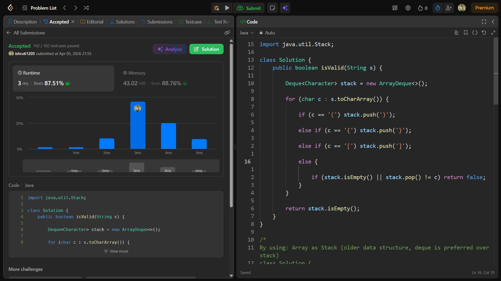

## Date: 05 April 2026 (Day 15)  
**Name:** Shruti  
**Programming Language:** Java 

## Problem Statement
[Easy] Valid Parentheses

## Approach
I used a stack (Deque) to store expected closing brackets while traversing the string; when a closing bracket appears, I check if it matches the top of the stack, ensuring the parentheses are balanced in O(n) time with O(n) memory.

## Code

```java
import java.util.Stack;

class Solution {
    public boolean isValid(String s) {

        Deque<Character> stack = new ArrayDeque<>();

        for (char c : s.toCharArray()) {

            if (c == '(') stack.push(')');

            else if (c == '{') stack.push('}');

            else if (c == '[') stack.push(']');

            else {

                if (stack.isEmpty() || stack.pop() != c) return false;
            }
        }

        return stack.isEmpty();
    }
}

/*
By using: Array as Stack (older data structure, deque is preferred over stack)
class Solution {
    public boolean isValid(String s) {

        if (s.length() % 2 != 0) return false;

        char[] stack = new char[s.length()];
        int top = -1;

        for (int i = 0; i < s.length(); i++) {

            char bracket = s.charAt(i);

            // PUSH - Opening brackets
            if (bracket == '(' || bracket == '[' || bracket == '{') {
                stack[++top] = bracket;
            }
            else {

                // Invalid: closing bracket with empty stack
                if (top == -1) return false;

                // POP
                char open = stack[top--];

                // Mismatch cases
                if (bracket == ')' && open != '(') return false;
                if (bracket == '}' && open != '{') return false;
                if (bracket == ']' && open != '[') return false;
            }
        }

        // Valid only if stack empty
        return top == -1;
    }
}
*/

/*
By using: Stack Data Structure
class Solution {
    public boolean isValid(String s) {

        Stack<Character> stack = new Stack<>();

        for (char c : s.toCharArray()) {

            // Push opening brackets
            if (c == '(' || c == '[' || c == '{') {
                stack.push(c);
            } 
            else {

                if (stack.isEmpty()) return false;

                char top = stack.pop();

                if (c == ')' && top != '(') return false;
                if (c == '}' && top != '{') return false;
                if (c == ']' && top != '[') return false;
            }
        }

        return stack.isEmpty();
    }
}
*/
```

## Accepted Solution Screenshot

