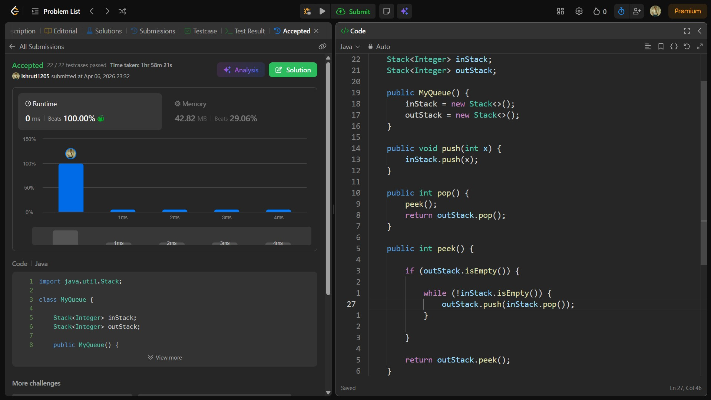

## Date: 06 April 2026 (Day 16)  
**Name:** Shruti  
**Programming Language:** Java 

## Problem Statement
[Easy] Implement Queue using Stacks

## Approach
I used two stacks to simulate queue behavior, where one stack handles incoming elements and the other provides elements in FIFO order by transferring items when needed, achieving amortized O(1) operations.

## Code

```java
import java.util.Stack;

class MyQueue {

    Stack<Integer> inStack;
    Stack<Integer> outStack;

    public MyQueue() {
        inStack = new Stack<>();
        outStack = new Stack<>();
    }
    
    public void push(int x) {
        inStack.push(x);
    }
    
    public int pop() {
        peek(); 
        return outStack.pop();
    }
    
    public int peek() {

        if (outStack.isEmpty()) {

            while (!inStack.isEmpty()) {
                outStack.push(inStack.pop());
            }

        }

        return outStack.peek();
    }
    
    public boolean empty() {
        return inStack.isEmpty() && outStack.isEmpty();
    }
}

/**
 * Your MyQueue object will be instantiated and called as such:
 * MyQueue obj = new MyQueue();
 * obj.push(x);
 * int param_2 = obj.pop();
 * int param_3 = obj.peek();
 * boolean param_4 = obj.empty();
 */
```

## Accepted Solution Screenshot

