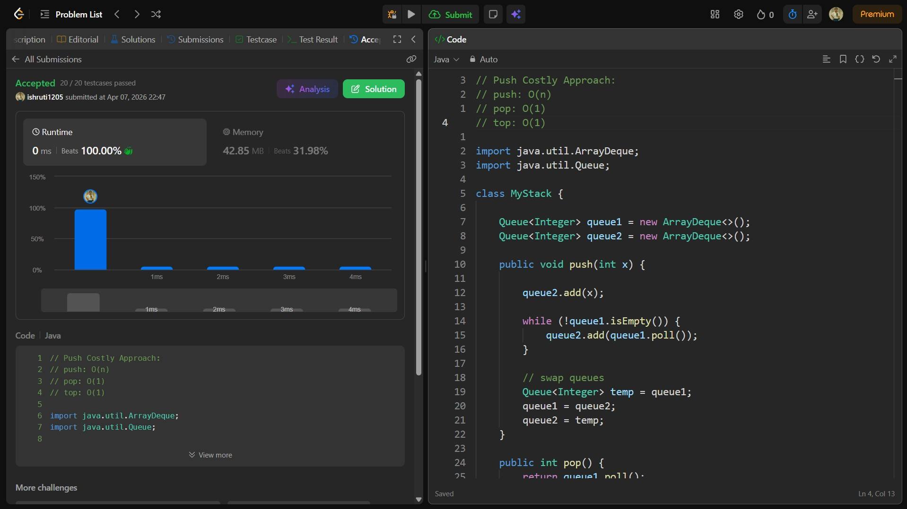

## Date: 07 April 2026 (Day 17)  
**Name:** Shruti  
**Programming Language:** Java 

## Problem Statement
[Easy] Implement Stack using Queues

## Approach
I used two queues where each new element is first inserted into a temporary queue and then all previous elements are moved behind it, ensuring the most recently added element stays at the front to simulate LIFO stack behavior.

## Code

```java
// Push Costly Approach:
// push: O(n)
// pop: O(1)
// top: O(1)

import java.util.ArrayDeque;
import java.util.Queue;

class MyStack {

    Queue<Integer> queue1 = new ArrayDeque<>();
    Queue<Integer> queue2 = new ArrayDeque<>();

    public void push(int x) {

        queue2.add(x);

        while (!queue1.isEmpty()) {
            queue2.add(queue1.poll());
        }

        // swap queues
        Queue<Integer> temp = queue1;
        queue1 = queue2;
        queue2 = temp;
    }
    
    public int pop() {
        return queue1.poll();
    }
    
    public int top() {
        return queue1.peek();
    }
    
    public boolean empty() {
        return queue1.isEmpty();
    }
}

/**
 * Your MyStack object will be instantiated and called as such:
 * MyStack obj = new MyStack();
 * obj.push(x);
 * int param_2 = obj.pop();
 * int param_3 = obj.top();
 * boolean param_4 = obj.empty();
 */

/*
// Pop-Top Costly Approach:
// push: O(1)
// pop: O(n)
// top: O(n)

class MyStack {

    Queue<Integer> queue1;
    Queue<Integer> queue2;

    public MyStack() {
        queue1 = new ArrayDeque<>();
        queue2 = new ArrayDeque<>();
    }
    
    public void push(int x) {
        queue1.add(x);
    }
    
    public int pop() {
        top();

        int remove = queue1.poll();

        // swap queues
        Queue<Integer> temp = queue1;
        queue1 = queue2;
        queue2 = temp;

        return remove;
    }
    
    public int top() {

        while (queue1.size() > 1) {
            queue2.add(queue1.poll());
        }

        return queue1.peek();
    }
    
    public boolean empty() {
        return queue1.isEmpty() && queue2.isEmpty();
    }
}

/**
 * Your MyStack object will be instantiated and called as such:
 * MyStack obj = new MyStack();
 * obj.push(x);
 * int param_2 = obj.pop();
 * int param_3 = obj.top();
 * boolean param_4 = obj.empty();
 */

 /*

 Queue1: 1, 2, 3 (Enqueue)
 Queue2: []
 Stack: (Push)
        3
        2
        1

 Queue1: 2, 3 (Dequeue)
 Queue2: []
 Stack: (Pop)
        2
        1

 Queue1: 3
 Queue2: 1, 2
 Stack:
        2
        1

Swap Queues:
Queue1: 1, 2
Queue2: []

*/
```

## Accepted Solution Screenshot

