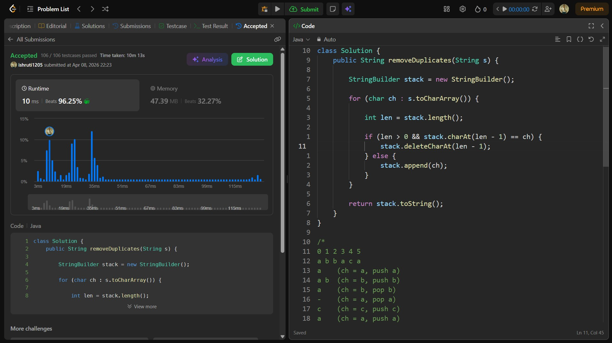

## Date: 08 April 2026 (Day 18)  
**Name:** Shruti  
**Programming Language:** Java 

## Problem Statement
[Easy] Remove All Duplicates In String

## Approach
I used a stack-like approach with StringBuilder to process the string character by character, removing the last character whenever a duplicate is found, ensuring all adjacent duplicates are eliminated in O(n) time.

## Code

```java
class Solution {
    public String removeDuplicates(String s) {
        
        StringBuilder stack = new StringBuilder();

        for (char ch : s.toCharArray()) {

            int len = stack.length();

            if (len > 0 && stack.charAt(len - 1) == ch) {
                stack.deleteCharAt(len - 1);
            } else {
                stack.append(ch);
            }
        }

        return stack.toString();
    }
}

/*
0 1 2 3 4 5
a b b a c a
a    (ch = a, push a)
a b  (ch = b, push b)
a    (ch = b, pop b)
-    (ch = a, pop a)
c    (ch = c, push c)
a    (ch = a, push a)
*/


/*
Using Recursion: 
(Logic correct, but 104/106 test cases passed due to 'Time Limit Exceeded')

Worst case Time Complexity: O(n²)

class Solution {
    public String removeDuplicates(String s) {
        
        for (int i = 0; i < s.length() - 1; i++) {

            if (s.charAt(i) == s.charAt(i + 1)) {

                String newStr = s.substring(0, i) + s.substring(i + 2);

                return removeDuplicates(newStr); // recursion
            }
        }

        return s; // base case: no duplicates found

    }
}

/*
0 1 2 3 4 5
a b b a c a
a a c a
c a
*/
```

## Accepted Solution Screenshot

