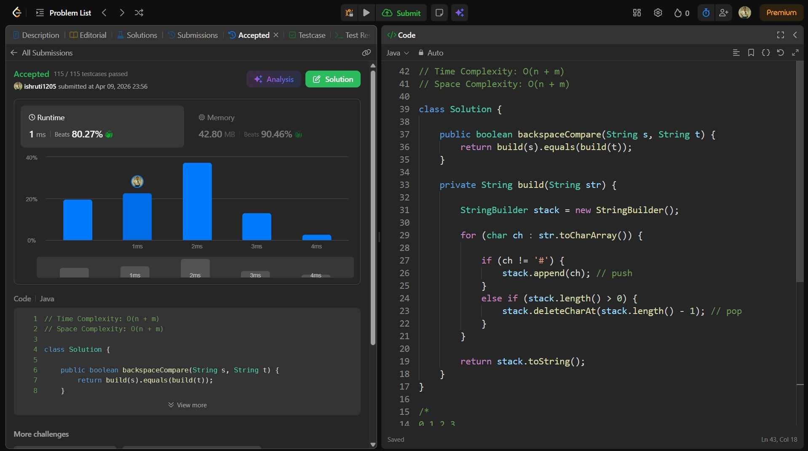

## Date: 09 April 2026 (Day 19)  
**Name:** Shruti  
**Programming Language:** Java 

## Problem Statement
[Easy] Backspace String Compare

## Approach
I used a stack-like approach with StringBuilder to simulate backspace operations for both strings and then compared the final processed strings to check if they are equal in O(n + m) time.

## Code

```java
// Time Complexity: O(n + m)
// Space Complexity: O(n + m)

class Solution {

    public boolean backspaceCompare(String s, String t) {
        return build(s).equals(build(t));
    }

    private String build(String str) {

        StringBuilder stack = new StringBuilder();

        for (char ch : str.toCharArray()) {

            if (ch != '#') {
                stack.append(ch); // push
            } 
            else if (stack.length() > 0) {
                stack.deleteCharAt(stack.length() - 1); // pop
            }
        }

        return stack.toString();
    }
}

/*
0 1 2 3
a b # c
a       (ch = a, push a)
a b     (ch = b, push b)
a       (ch = #, pop b)
a c     (ch = c, push c)

0 1 2 3
a d # c
a       (ch = a, push a)
a d     (ch = d, push d)
a       (ch = #, pop d)
a c     (ch = c, push c)

=> ac = ac (s = t)
*/
```

## Accepted Solution Screenshot

