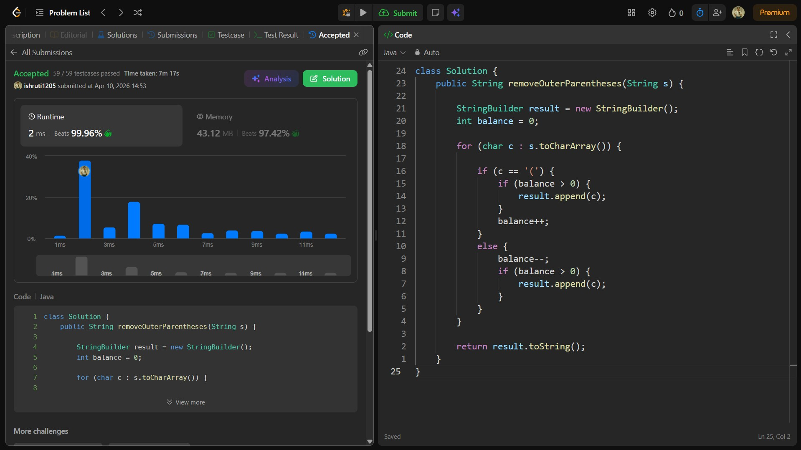

## Date: 10 April 2026 (Day 20)  
**Name:** Shruti  
**Programming Language:** Java 

## Problem Statement
[Easy] Remove Outermost Parenthesis

## Approach
I used a counter (balance) approach to track the depth of parentheses and append characters only when they are not part of the outermost layer, effectively removing outer parentheses in O(n) time.

## Code

```java
class Solution {
    public String removeOuterParentheses(String s) {

        StringBuilder result = new StringBuilder();
        int balance = 0;

        for (char c : s.toCharArray()) {

            if (c == '(') {
                if (balance > 0) {
                    result.append(c);
                }
                balance++;
            } 
            else {
                balance--;
                if (balance > 0) {
                    result.append(c);
                }
            }
        }

        return result.toString();
    }
}
```

## Accepted Solution Screenshot

