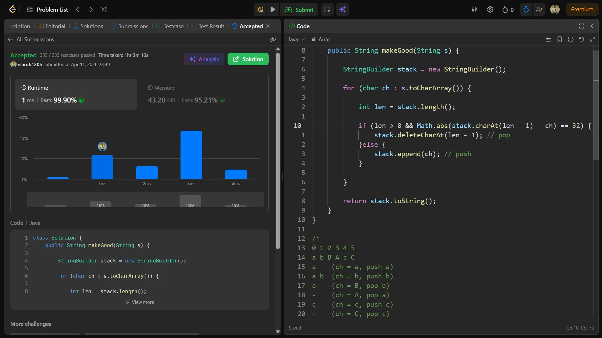

## Date: 11 April 2026 (Day 21)  
**Name:** Shruti  
**Programming Language:** Java 

## Problem Statement
[Easy] Make The String Great

## Approach
I used a stack-like approach with StringBuilder to remove adjacent characters that are the same letter but different cases, by checking their ASCII difference and eliminating such pairs in O(n) time.

## Code

```java
class Solution {
    public String makeGood(String s) {
        
        StringBuilder stack = new StringBuilder();

        for (char ch : s.toCharArray()) {

            int len = stack.length();

            if (len > 0 && Math.abs(stack.charAt(len - 1) - ch) == 32) {
                stack.deleteCharAt(len - 1); // pop
            }else {
                stack.append(ch); // push
            }

        }
        
        return stack.toString();
    }
}

/*
0 1 2 3 4 5
a b B A c C
a    (ch = a, push a)
a b  (ch = b, push b)
a    (ch = B, pop b)
-    (ch = A, pop a)
c    (ch = c, push c)
-    (ch = C, pop c)
*/

/*
class Solution {
    public String makeGood(String s) {
        
        StringBuilder stack = new StringBuilder();

        for (char ch : s.toCharArray()) {

            int len = stack.length();

            if (len > 0){

                boolean valueCheck = Character.toLowerCase(stack.charAt(len - 1)) == Character.toLowerCase(ch);

                boolean upperCaseCheck = Character.isUpperCase(stack.charAt(len - 1)) == Character.isUpperCase(ch);

                boolean lowerCaseCheck = Character.isLowerCase(stack.charAt(len - 1)) == Character.isLowerCase(ch);

                if (valueCheck && !upperCaseCheck && !lowerCaseCheck ) {
                    stack.deleteCharAt(len - 1);
                } else {
                    stack.append(ch);
                }

            }else {
                stack.append(ch);
            }
        }

        return stack.toString();
    }
}
*/
```

## Accepted Solution Screenshot

