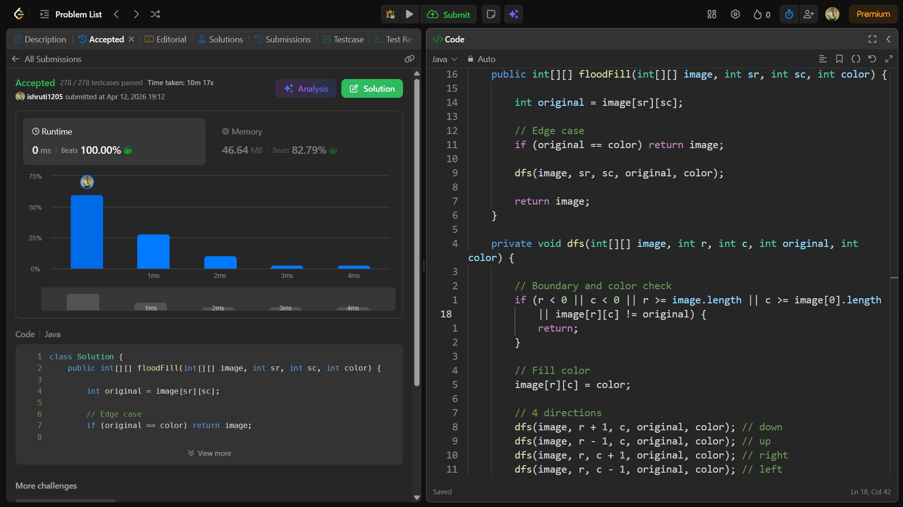

## Date: 12 April 2026 (Day 22)  
**Name:** Shruti  
**Programming Language:** Java 

## Problem Statement
[Easy] Flood Fill

## Approach
I used a Depth First Search (DFS) approach to recursively traverse all connected pixels with the same initial color and update them to the new color in O(n × m) time.

## Code

```java
class Solution {
    public int[][] floodFill(int[][] image, int sr, int sc, int color) {

        int original = image[sr][sc];

        // Edge case
        if (original == color) return image;

        dfs(image, sr, sc, original, color);

        return image;
    }

    private void dfs(int[][] image, int r, int c, int original, int color) {

        // Boundary and color check
        if (r < 0 || c < 0 || r >= image.length || c >= image[0].length
            || image[r][c] != original) {
            return;
        }

        // Fill color
        image[r][c] = color;

        // 4 directions
        dfs(image, r + 1, c, original, color); // down
        dfs(image, r - 1, c, original, color); // up
        dfs(image, r, c + 1, original, color); // right
        dfs(image, r, c - 1, original, color); // left
    }
}
```

## Accepted Solution Screenshot

