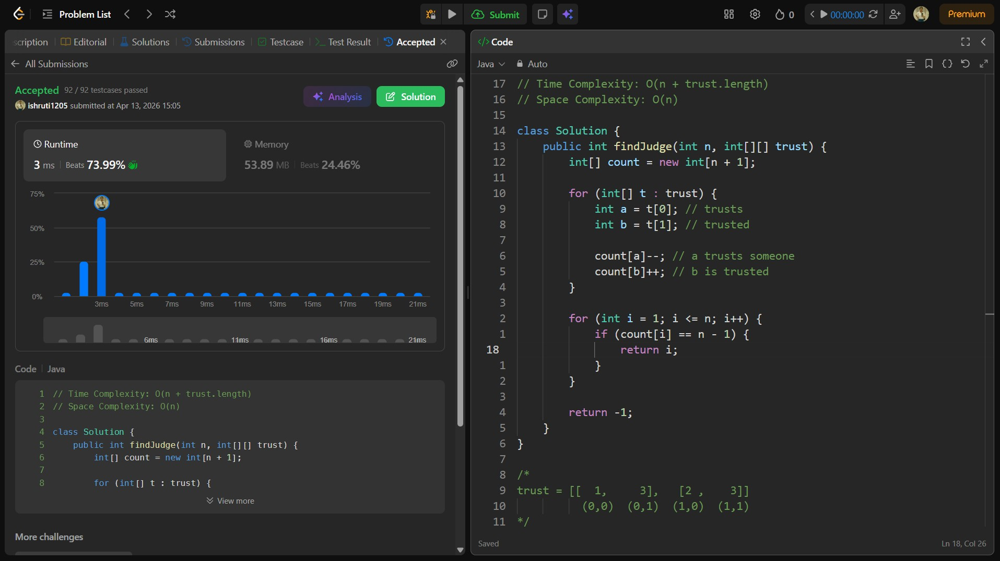

## Date: 13 April 2026 (Day 23)  
**Name:** Shruti  
**Programming Language:** Java 

## Problem Statement
[Easy] Find the Town Judge

## Approach
I used an array to track trust counts by decreasing the count for people who trust others and increasing it for those being trusted, then identified the person with count n - 1 as the town judge in O(n + E) time.

## Code

```java
// Time Complexity: O(n + trust.length)
// Space Complexity: O(n)

class Solution {
    public int findJudge(int n, int[][] trust) {
        int[] count = new int[n + 1];

        for (int[] t : trust) {
            int a = t[0]; // trusts
            int b = t[1]; // trusted

            count[a]--; // a trusts someone
            count[b]++; // b is trusted
        }

        for (int i = 1; i <= n; i++) {
            if (count[i] == n - 1) {
                return i;
            }
        }

        return -1;
    }
}

/*
trust = [[  1,     3],   [2 ,    3]]
          (0,0)  (0,1)  (1,0)  (1,1)
*/
```

## Accepted Solution Screenshot

