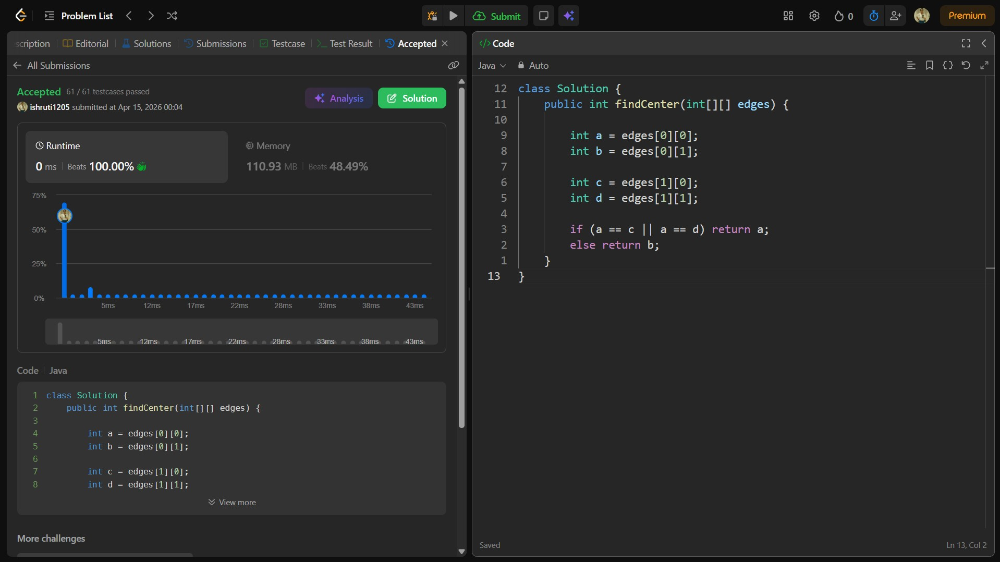

## Date: 14 April 2026 (Day 24)  
**Name:** Shruti  
**Programming Language:** Java 

## Problem Statement
[Easy] Find the Center of Star Graph

## Approach
[]

## Code

```java
// Time Complexity:
// Space Complexity:

class Solution {
    public int findCenter(int[][] edges) {
        
    }
}
```

## Accepted Solution Screenshot

