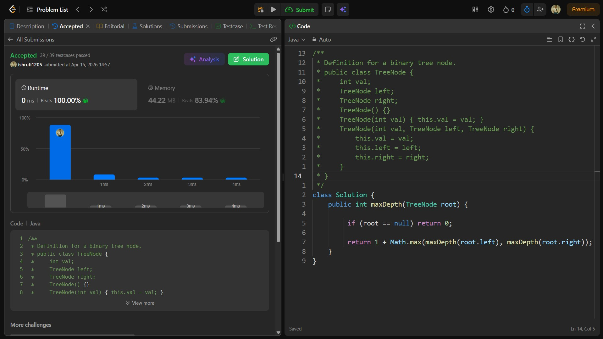

## Date: 15 April 2026 (Day 25)  
**Name:** Shruti  
**Programming Language:** Java 

## Problem Statement
[Easy] Maximum Depth of Binary Tree

## Approach
I used a recursive Depth First Search (DFS) approach to calculate the depth of left and right subtrees and return the maximum of both plus one, giving the height of the tree in O(n) time.

## Code

```java
/**
 * Definition for a binary tree node.
 * public class TreeNode {
 *     int val;
 *     TreeNode left;
 *     TreeNode right;
 *     TreeNode() {}
 *     TreeNode(int val) { this.val = val; }
 *     TreeNode(int val, TreeNode left, TreeNode right) {
 *         this.val = val;
 *         this.left = left;
 *         this.right = right;
 *     }
 * }
 */
class Solution {
    public int maxDepth(TreeNode root) {
        
         if (root == null) return 0;
         
         return 1 + Math.max(maxDepth(root.left), maxDepth(root.right));
    }
}
```

## Accepted Solution Screenshot

