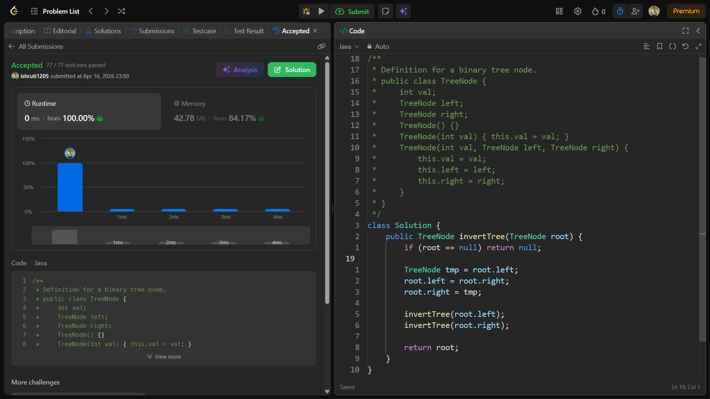

## Date: 16 April 2026 (Day 26)  
**Name:** Shruti  
**Programming Language:** Java 

## Problem Statement
[Easy] Invert Binary Tree

## Approach
I used a recursive DFS approach to swap the left and right children of each node and recursively invert the subtrees, effectively mirroring the binary tree in O(n) time.

## Code

```java
/**
 * Definition for a binary tree node.
 * public class TreeNode {
 *     int val;
 *     TreeNode left;
 *     TreeNode right;
 *     TreeNode() {}
 *     TreeNode(int val) { this.val = val; }
 *     TreeNode(int val, TreeNode left, TreeNode right) {
 *         this.val = val;
 *         this.left = left;
 *         this.right = right;
 *     }
 * }
 */
class Solution {
    public TreeNode invertTree(TreeNode root) {
        if (root == null) return null;

        TreeNode tmp = root.left; 
        root.left = root.right; 
        root.right = tmp;

        invertTree(root.left); 
        invertTree(root.right);

        return root;
    }
}
```

## Accepted Solution Screenshot

