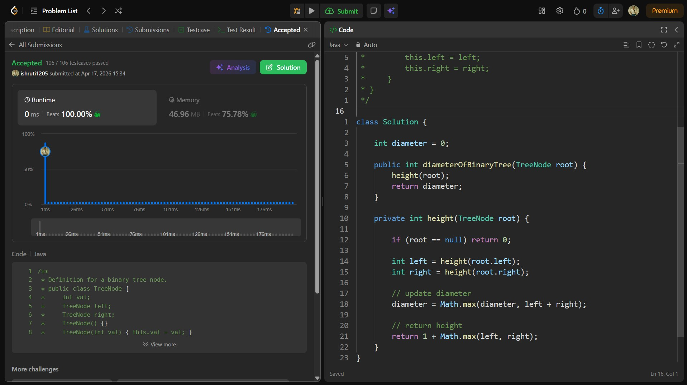

## Date: 17 April 2026 (Day 27)  
**Name:** Shruti  
**Programming Language:** Java 

## Problem Statement
[Easy] Diameter of Binary Tree

## Approach
I used a recursive DFS approach to swap the left and right children of each node and recursively invert the subtrees, effectively mirroring the binary tree in O(n) time.

## Code

```java
/**
 * Definition for a binary tree node.
 * public class TreeNode {
 *     int val;
 *     TreeNode left;
 *     TreeNode right;
 *     TreeNode() {}
 *     TreeNode(int val) { this.val = val; }
 *     TreeNode(int val, TreeNode left, TreeNode right) {
 *         this.val = val;
 *         this.left = left;
 *         this.right = right;
 *     }
 * }
 */

class Solution {

    int diameter = 0;

    public int diameterOfBinaryTree(TreeNode root) {
        height(root);
        return diameter;
    }

    private int height(TreeNode root) {

        if (root == null) return 0;

        int left = height(root.left);
        int right = height(root.right);

        // update diameter
        diameter = Math.max(diameter, left + right);

        // return height
        return 1 + Math.max(left, right);
    }
}
```

## Accepted Solution Screenshot

