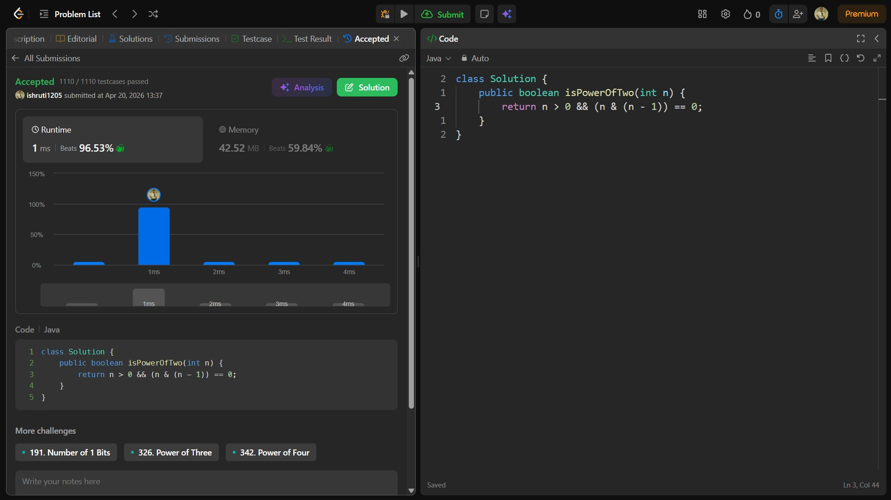

## Date: 19 April 2026 (Day 29)  
**Name:** Shruti  
**Programming Language:** Java 

## Problem Statement
[Easy] Power of Two

## Approach
I used a bit manipulation technique where a power of two has only one set bit, so checking (n & (n - 1)) == 0 confirms it in O(1) time.

## Code

```java
class Solution {
    public boolean isPowerOfTwo(int n) {
        return n > 0 && (n & (n - 1)) == 0;
    }
}
```

## Accepted Solution Screenshot

