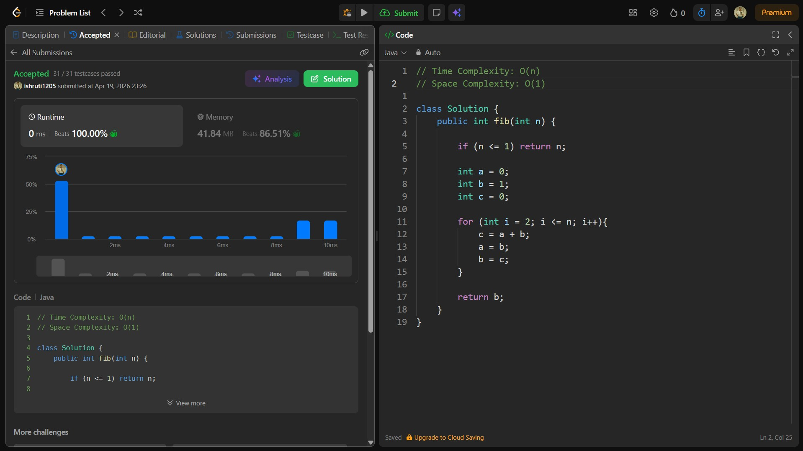

## Date: 19 April 2026 (Day 29)  
**Name:** Shruti  
**Programming Language:** Java 

## Problem Statement
[Easy] Fibonacci Number

## Approach
I used an iterative approach to build the Fibonacci sequence by maintaining the last two values and updating them in each step, achieving O(n) time and O(1) space complexity.

## Code

```java
// Time Complexity: O(n)
// Space Complexity: O(1)

class Solution {
    public int fib(int n) {

        if (n <= 1) return n;
        
        int a = 0;
        int b = 1;
        int c = 0;
        
        for (int i = 2; i <= n; i++){ 
            c = a + b; 
            a = b; 
            b = c; 
        }

        return b;
    }
}
```

## Accepted Solution Screenshot

