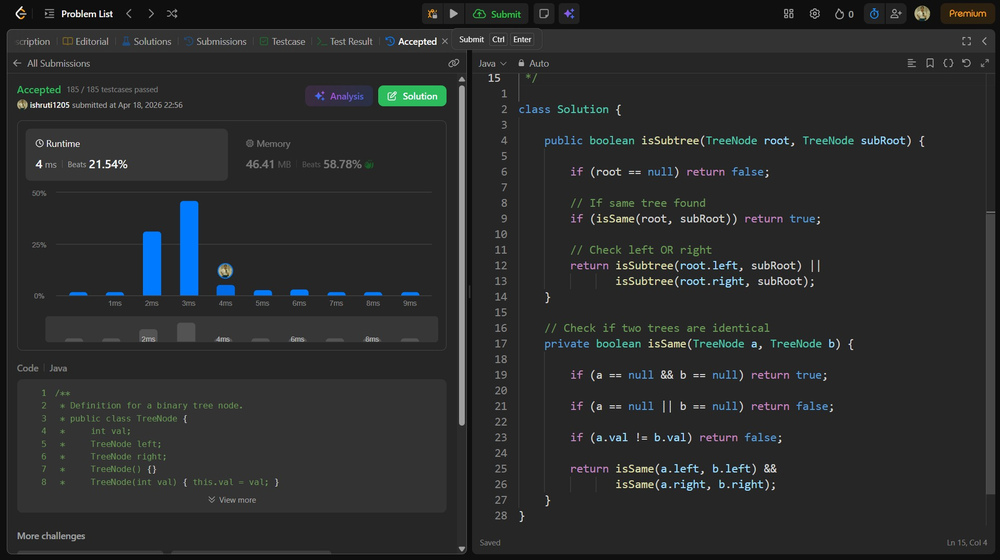

## Date: 18 April 2026 (Day 28)  
**Name:** Shruti  
**Programming Language:** Java 

## Problem Statement
[Easy] Subtree of Another Tree

## Approach
I used a recursive DFS approach to traverse the main tree and, at each node, checked whether the subtree starting from that node is identical to the given subtree using a helper function, resulting in O(n × m) time in the worst case.

## Code

```java
/**
 * Definition for a binary tree node.
 * public class TreeNode {
 *     int val;
 *     TreeNode left;
 *     TreeNode right;
 *     TreeNode() {}
 *     TreeNode(int val) { this.val = val; }
 *     TreeNode(int val, TreeNode left, TreeNode right) {
 *         this.val = val;
 *         this.left = left;
 *         this.right = right;
 *     }
 * }
 */

class Solution {

    public boolean isSubtree(TreeNode root, TreeNode subRoot) {

        if (root == null) return false;

        // If same tree found
        if (isSame(root, subRoot)) return true;

        // Check left OR right
        return isSubtree(root.left, subRoot) || 
               isSubtree(root.right, subRoot);
    }

    // Check if two trees are identical
    private boolean isSame(TreeNode a, TreeNode b) {

        if (a == null && b == null) return true;

        if (a == null || b == null) return false;

        if (a.val != b.val) return false;

        return isSame(a.left, b.left) && 
               isSame(a.right, b.right);
    }
}
```

## Accepted Solution Screenshot

