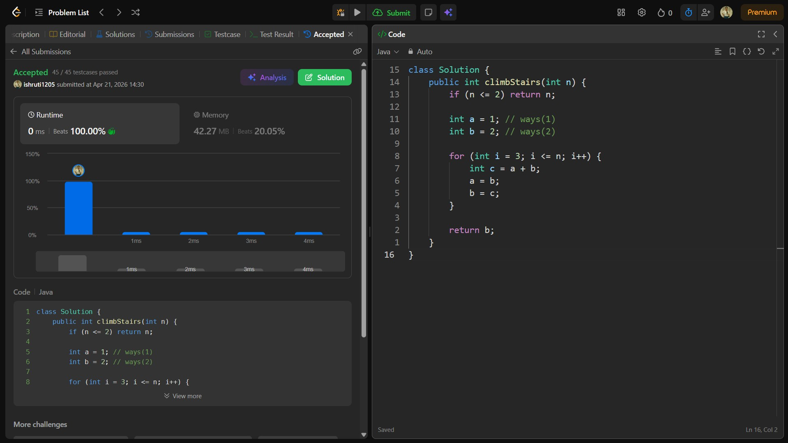

## Date: 21 April 2026 (Day 31)  
**Name:** Shruti  
**Programming Language:** Java 

## Problem Statement
[Easy] Climbing Stairs

## Approach
I used a dynamic programming approach similar to Fibonacci, where the number of ways to reach step n is the sum of ways to reach n-1 and n-2, computed iteratively in O(n) time and O(1) space.

## Code

```java
class Solution {
    public int climbStairs(int n) {
        if (n <= 2) return n;

        int a = 1; // ways(1)
        int b = 2; // ways(2)

        for (int i = 3; i <= n; i++) {
            int c = a + b;
            a = b;
            b = c;
        }

        return b;
    }
}
```

## Accepted Solution Screenshot

