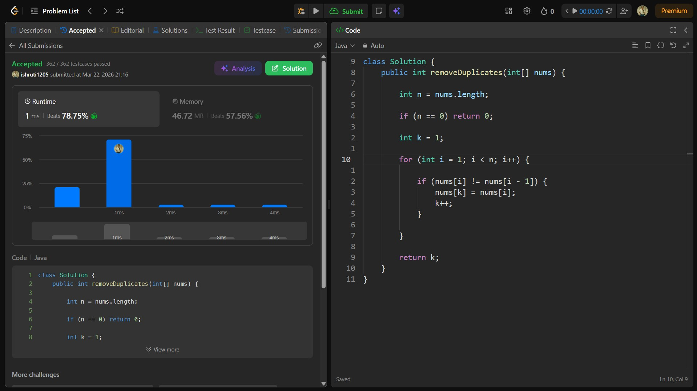

## Date: 22 March 2026 (Day 1)  
**Name:** Shruti  
**Programming Language:** Java 

## Problem Statement
[Easy] Remove Duplicates from Sorted Array

## Approach
I used a two-pointer approach to iterate through the array and remove duplicates efficiently in O(n) time.

## Code

```java
class Solution {
    public int removeDuplicates(int[] nums) {

        int n = nums.length;

        if (n == 0) return 0;

        int k = 1;

        for (int i = 1; i < n; i++) {
            if (nums[i] != nums[k-1]) {
                nums[k] = nums[i];
                k++;
            }
        }

        return k;
    }
}
```

## Accepted Solution Screenshot

