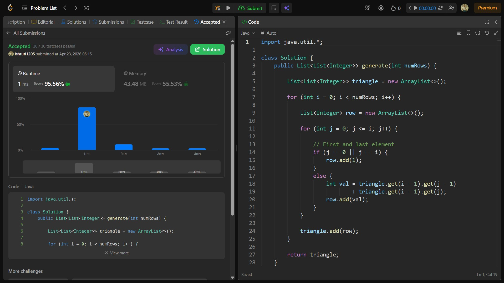

## Date: 22 April 2026 (Day 32)  
**Name:** Shruti  
**Programming Language:** Java 

## Problem Statement
[Easy] Pascal's Triangle

## Approach
I used a dynamic programming approach similar to Fibonacci, where the number of ways to reach step n is the sum of ways to reach n-1 and n-2, computed iteratively in O(n) time and O(1) space.

## Code

```java
import java.util.*;

class Solution {
    public List<List<Integer>> generate(int numRows) {

        List<List<Integer>> triangle = new ArrayList<>();

        for (int i = 0; i < numRows; i++) {

            List<Integer> row = new ArrayList<>();

            for (int j = 0; j <= i; j++) {

                // First and last element
                if (j == 0 || j == i) {
                    row.add(1);
                } 
                else {
                    int val = triangle.get(i - 1).get(j - 1) 
                            + triangle.get(i - 1).get(j);
                    row.add(val);
                }
            }

            triangle.add(row);
        }

        return triangle;
    }
}
```

## Accepted Solution Screenshot

