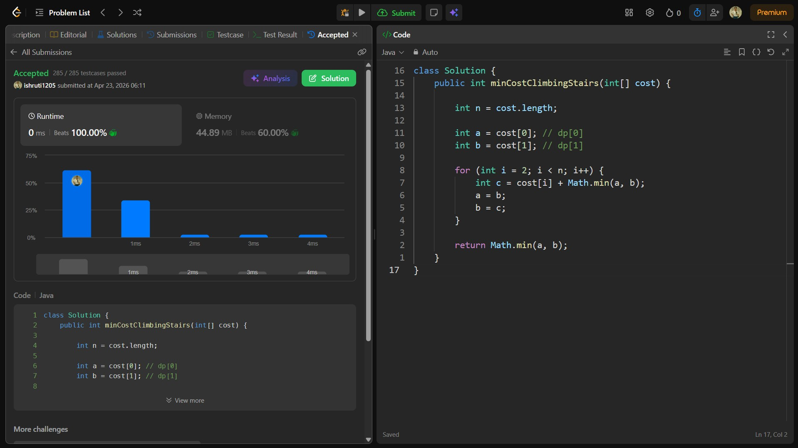

## Date: 23 April 2026 (Day 33)  
**Name:** Shruti  
**Programming Language:** Java 

## Problem Statement
[Easy] Min Cost Climbing Stairs

## Approach
I used a dynamic programming approach to compute the minimum cost to reach each step by taking the minimum of the previous two steps, updating values iteratively to achieve O(n) time and O(1) space complexity.

## Code

```java
class Solution {
    public int minCostClimbingStairs(int[] cost) {

        int n = cost.length;

        int a = cost[0]; // dp[0]
        int b = cost[1]; // dp[1]

        for (int i = 2; i < n; i++) {
            int c = cost[i] + Math.min(a, b);
            a = b;
            b = c;
        }

        return Math.min(a, b);
    }
}
```

## Accepted Solution Screenshot

