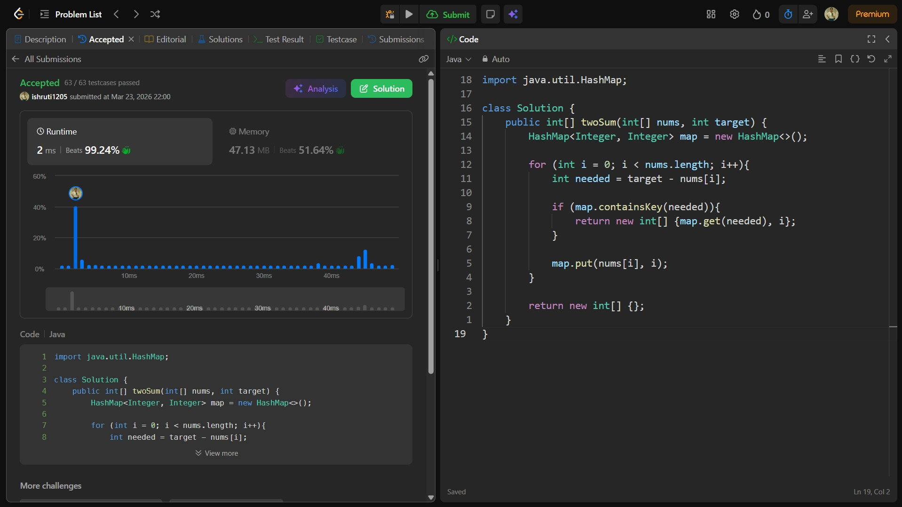

## Date: 23 March 2026 (Day 2)  
**Name:** Shruti  
**Programming Language:** Java 

## Problem Statement
[Easy] Two Sum

## Approach
I used a HashMap to iterate through the array once and check if the complement of the current element already exists, allowing the pair to be found efficiently in O(n) time.

## Code

```java
import java.util.HashMap;

class Solution {
    public int[] twoSum(int[] nums, int target) {
        HashMap<Integer, Integer> map = new HashMap<>();

        for (int i = 0; i < nums.length; i++){
            int needed = target - nums[i];

            if (map.containsKey(needed)){
                return new int[] {map.get(needed), i};
            }

            map.put(nums[i], i);
        }

        return new int[] {};
    }
}
```

## Accepted Solution Screenshot

