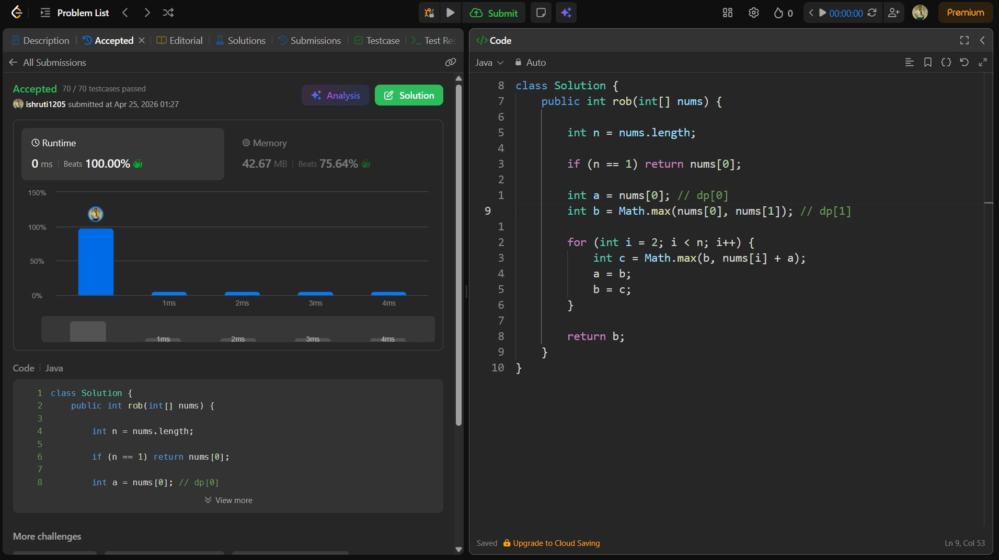

## Date: 24 April 2026 (Day 34)  
**Name:** Shruti  
**Programming Language:** Java 

## Problem Statement
[Medium] House Robber

## Approach
I used a dynamic programming approach to decide at each house whether to rob it or skip it by taking the maximum of previous profit or current value plus the profit from two steps back, achieving O(n) time and O(1) space.

## Code

```java
class Solution {
    public int rob(int[] nums) {

        int n = nums.length;

        if (n == 1) return nums[0];

        int a = nums[0]; // dp[0]
        int b = Math.max(nums[0], nums[1]); // dp[1]

        for (int i = 2; i < n; i++) {
            int c = Math.max(b, nums[i] + a);
            a = b;
            b = c;
        }

        return b;
    }
}
```

## Accepted Solution Screenshot

