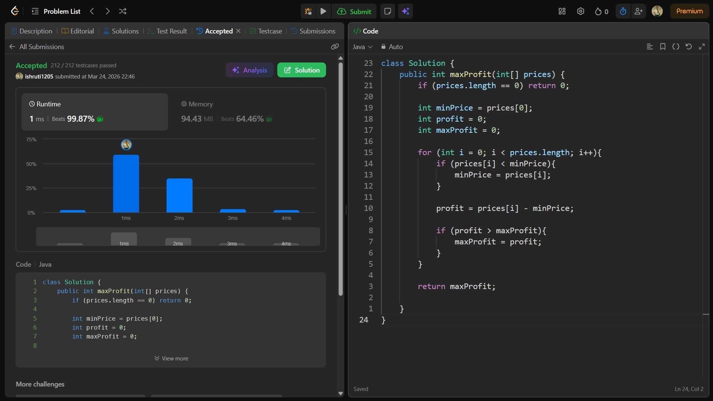

## Date: 24 March 2026 (Day 3)  
**Name:** Shruti  
**Programming Language:** Java 

## Problem Statement
[Easy] Best Time to Buy and Sell Stock

## Approach
I iterated through the array while keeping track of the minimum price seen so far and calculated the profit for each day, updating the maximum profit whenever a larger profit was found, achieving an O(n) time complexity.

## Code

```java
class Solution {
    public int maxProfit(int[] prices) {
        if (prices.length == 0) return 0;

        int minPrice = prices[0];
        int profit = 0;
        int maxProfit = 0;

        for (int i = 0; i < prices.length; i++){
            if (prices[i] < minPrice){
                minPrice = prices[i];
            }

            profit = prices[i] - minPrice;

            if (profit > maxProfit){
                maxProfit = profit;
            }
        }

        return maxProfit;

    }
}
```

## Accepted Solution Screenshot

