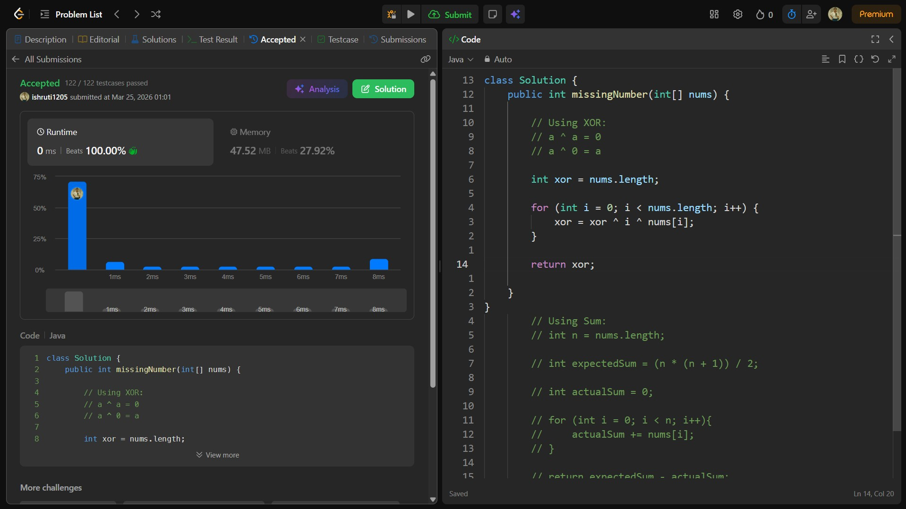

## Date: 25 March 2026 (Day 4)  
**Name:** Shruti  
**Programming Language:** Java 

## Problem Statement
[Easy] Missing Number

## Approach
I used the XOR technique by XORing all indices and array elements so that duplicate values cancel out, leaving the missing number in O(n) time and O(1) space.

## Code

```java
class Solution {
    public int missingNumber(int[] nums) {

        // Using XOR:
        // a ^ a = 0
        // a ^ 0 = a

        int xor = nums.length;

        for (int i = 0; i < nums.length; i++) {
            xor = xor ^ i ^ nums[i];
        }

        return xor;

    }
}
        // Using Sum:
        // int n = nums.length;

        // int expectedSum = (n * (n + 1)) / 2;

        // int actualSum = 0;

        // for (int i = 0; i < n; i++){
        //     actualSum += nums[i];
        // }

        // return expectedSum - actualSum;
```

## Accepted Solution Screenshot

