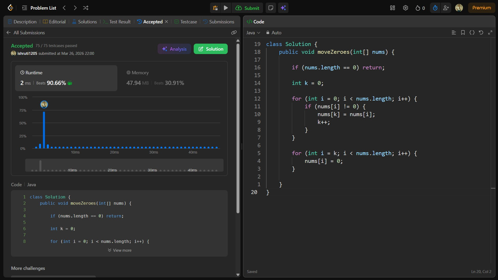

## Date: 26 March 2026 (Day 5)  
**Name:** Shruti  
**Programming Language:** Java 

## Problem Statement
[Easy] Move Zeroes

## Approach
I used a two-pointer approach to move all non-zero elements to the front of the array while maintaining their order, and then filled the remaining positions with zeros in O(n) time.

## Code

```java
class Solution {
    public void moveZeroes(int[] nums) {

        if (nums.length == 0) return;

        int k = 0;

        for (int i = 0; i < nums.length; i++) {
            if (nums[i] != 0) {
                nums[k] = nums[i];
                k++;
            }
        }

        for (int i = k; i < nums.length; i++) {
            nums[i] = 0;
        }
        
    }
}
```

## Accepted Solution Screenshot

