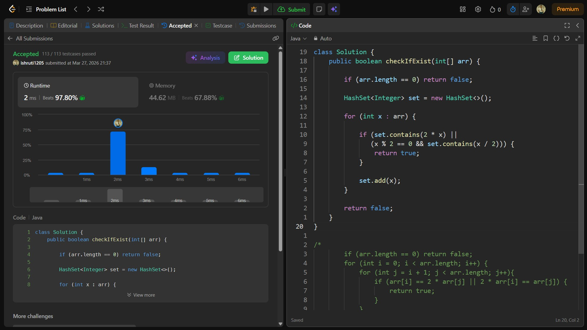

## Date: 27 March 2026 (Day 6)  
**Name:** Shruti  
**Programming Language:** Java 

## Problem Statement
[Easy] Check If N and Its Double Exist

## Approach
I used a HashSet to store visited elements while iterating through the array and checked whether the current element’s double or half already exists in the set, allowing the condition to be verified in O(n) time.

## Code

```java
class Solution {
    public boolean checkIfExist(int[] arr) {

        if (arr.length == 0) return false;

        HashSet<Integer> set = new HashSet<>();

        for (int x : arr) {

            if (set.contains(2 * x) || 
               (x % 2 == 0 && set.contains(x / 2))) {
                return true;
            }

            set.add(x);
        }

        return false;
    }
}

/*
        if (arr.length == 0) return false;
        for (int i = 0; i < arr.length; i++) {
            for (int j = i + 1; j < arr.length; j++){
                if (arr[i] == 2 * arr[j] || 2 * arr[i] == arr[j]) {
                    return true;
                }
            }
        }

        return false;
*/
```

## Accepted Solution Screenshot

