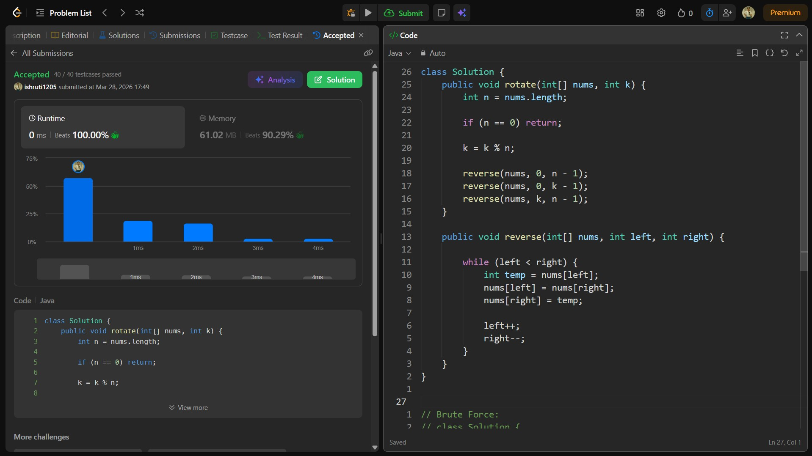

## Date: 28 March 2026 (Day 7)  
**Name:** Shruti  
**Programming Language:** Java 

## Problem Statement
[Medium] Rotate Array

## Approach
I used the array reversal technique by first reversing the entire array, then reversing the first k elements and the remaining elements separately to achieve the required rotation in O(n) time and O(1) space.

## Code

```java
class Solution {
    public void rotate(int[] nums, int k) {
        int n = nums.length;

        if (n == 0) return;
        
        k = k % n;

        reverse(nums, 0, n - 1);
        reverse(nums, 0, k - 1);
        reverse(nums, k, n - 1);
    }

    public void reverse(int[] nums, int left, int right) {

        while (left < right) {
            int temp = nums[left];
            nums[left] = nums[right];
            nums[right] = temp;

            left++;
            right--;
        }
    }
}


// Brute Force:
// class Solution {
//     public void rotate(int[] nums, int k) {
//         int n = nums.length;

//         if (n == 0) return;

//         k = k % n;

//         int temp;

//         for (int i = 0; i < k; i++) {
//             temp = nums[n-1];
//             for (int j = n - 1; j >= 1; j--){
//                 nums[j] = nums[j-1];
//             }
//             nums[0] = temp;
//         }
//     }
// }
```

## Accepted Solution Screenshot

