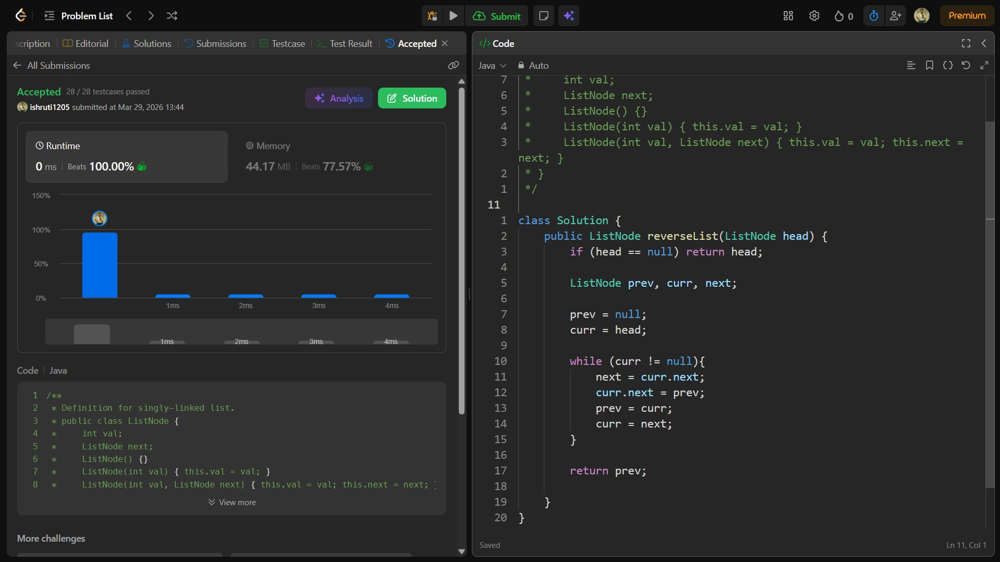

## Date: 29 March 2026 (Day 8)  
**Name:** Shruti  
**Programming Language:** Java 

## Problem Statement
[Easy] Reverse Linked List

## Approach
I used an iterative approach with three pointers (prev, curr, next) to reverse the links of the list one by one while traversing it, resulting in the reversed linked list in O(n) time and O(1) space.

## Code

```java
/**
 * Definition for singly-linked list.
 * public class ListNode {
 *     int val;
 *     ListNode next;
 *     ListNode() {}
 *     ListNode(int val) { this.val = val; }
 *     ListNode(int val, ListNode next) { this.val = val; this.next = next; }
 * }
 */
 
class Solution {
    public ListNode reverseList(ListNode head) {
        if (head == null) return head;

        ListNode prev, curr, next;

        prev = null;
        curr = head;

        while (curr != null){
            next = curr.next;
            curr.next = prev;
            prev = curr;
            curr = next;
        }

        return prev;

    }
}
```

## Accepted Solution Screenshot

