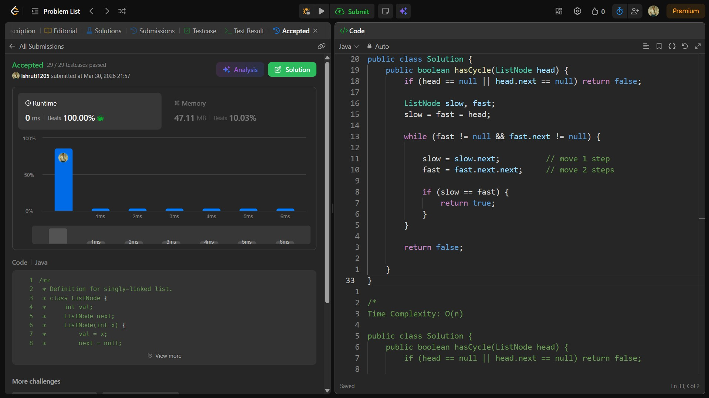

## Date: 30 March 2026 (Day 9)  
**Name:** Shruti  
**Programming Language:** Java 

## Problem Statement
[Easy] Linked List Cycle

## Approach
I used the Floyd’s Cycle Detection (slow and fast pointer) technique, where one pointer moves one step and the other moves two steps; if they meet, it indicates the presence of a cycle in O(n) time and O(1) space.

## Code

```java
/**
 * Definition for singly-linked list.
 * class ListNode {
 *     int val;
 *     ListNode next;
 *     ListNode(int x) {
 *         val = x;
 *         next = null;
 *     }
 * }
 */

public class Solution {
    public boolean hasCycle(ListNode head) {
        if (head == null || head.next == null) return false;

        ListNode slow, fast;
        slow = fast = head;

        while (fast != null && fast.next != null) {

            slow = slow.next;          // move 1 step
            fast = fast.next.next;     // move 2 steps

            if (slow == fast) {
                return true;
            }
        }

        return false;

    }
}

/*
Time Complexity: O(n)

public class Solution {
    public boolean hasCycle(ListNode head) {
        if (head == null || head.next == null) return false;

        HashSet<ListNode> set = new HashSet<>();
        ListNode curr = head;

        while (curr != null) {

            if (set.contains(curr)) {
                return true;
            }

            set.add(curr);
            curr = curr.next;
        }

        return false;

    }
}
*/
```

## Accepted Solution Screenshot

