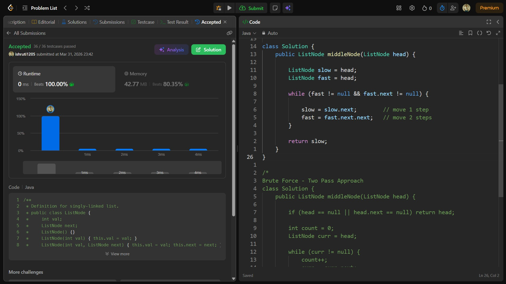

## Date: 31 March 2026 (Day 10)  
**Name:** Shruti  
**Programming Language:** Java 

## Problem Statement
[Easy] Middle of the Linked List

## Approach
I used the slow and fast pointer technique, where the slow pointer moves one step and the fast pointer moves two steps; when the fast pointer reaches the end, the slow pointer will be at the middle of the linked list in O(n) time.

## Code

```java
/**
 * Definition for singly-linked list.
 * public class ListNode {
 *     int val;
 *     ListNode next;
 *     ListNode() {}
 *     ListNode(int val) { this.val = val; }
 *     ListNode(int val, ListNode next) { this.val = val; this.next = next; }
 * }
 */

class Solution {
    public ListNode middleNode(ListNode head) {

        ListNode slow = head;
        ListNode fast = head;

        while (fast != null && fast.next != null) {

            slow = slow.next;        // move 1 step
            fast = fast.next.next;   // move 2 steps
        }

        return slow;
    }
}

/*
Brute Force - Two Pass Approach
class Solution {
    public ListNode middleNode(ListNode head) {

        if (head == null || head.next == null) return head;

        int count = 0;
        ListNode curr = head;

        while (curr != null) {
            count++;
            curr = curr.next;
        }

        int middle = count / 2;

        curr = head;

        for (int i = 0; i < middle; i++) {
            curr = curr.next;
        }

        return curr;
    }
}
*/
```

## Accepted Solution Screenshot

